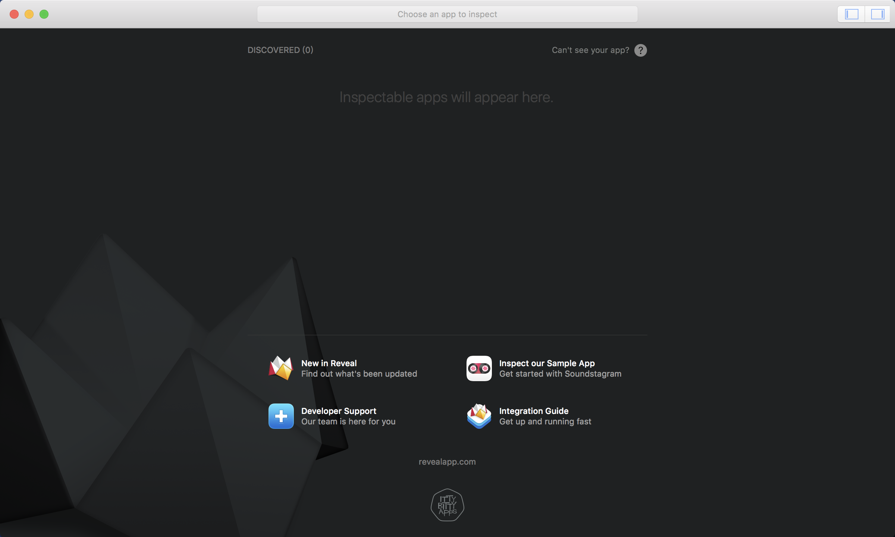
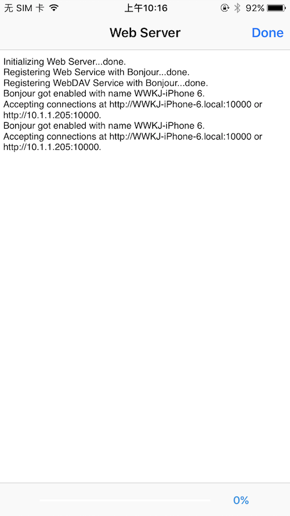
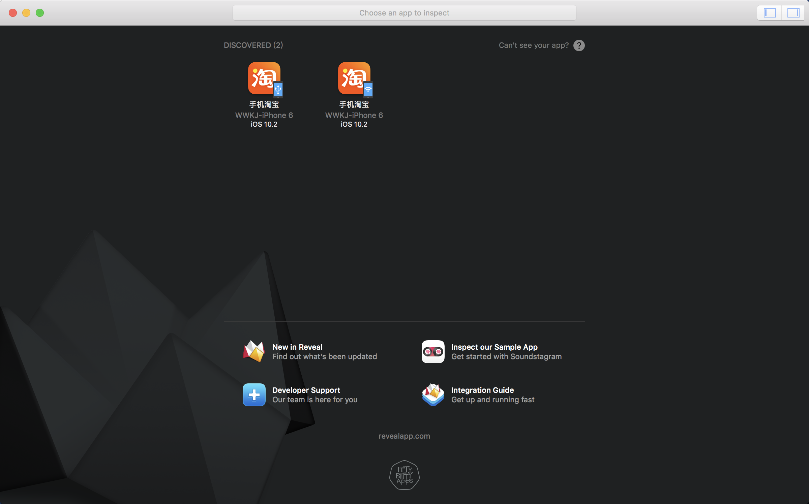

最新Reveal查看任意App的方法

本教程中不需要使用 ***Open SSH***，因为我在终端中输入ssh命令时没有响应，原因未知

### 前期准备
* 越狱iPhone一台，Reveal任意版本
> 注：本文的设备是iPhone6，系统iOS10.2；Reveal4

### 软件配置
* #### iPhone
 1.越狱。越狱教程自行搜索
 2.在Cydia中搜索并安装 ***iFile、Reveal2Loader***
 3.***iFile*** 安装好，回到桌面找到 ***iFile*** 应用，打开后就能看到系统的文件目录
  > iFile中可能会弹出“Registration Failed”的窗口，直接关闭即可，没有影响

 4.iPhone的设置中，会出现 ***Reveal*** 选项，进入 ***Enabled Applications*** 中就是手机内的所有App
  > 当所有步骤完成后，在此处打开你想Debug的App开关即可。

* #### Reveal
 1.打开 ***Reveal*** 后的界面应该是如下图  
 

 2.此时点击屏幕顶部的 ***help => Show Reveal Library in Finder => iOS Library*** 选项，将 ***RevealServer.framework*** 拷贝到桌面
 3.将 ***RevealServer.framework*** 压缩，系统压缩后的后缀应该是**".zip"**，其实无所谓
 
### 最终奥义！
**1.** 电脑和iPhone连接同一个WIFI
**2.** 打开 ***iFile***，点击底部的，然后等待自动执行到如下界面  

**3.** 电脑浏览器的网址输入框中输入上图中出现的 **http://192.168.1.104:10000**，**192.168.1.104** 是iPhone的IP地址，**10000** 是分配的端口号
> 文件操作过程中，如果点击了右上角的 **"Done"**，或者回到主屏幕，造成“操作2”中出现的界面消失，链接将无法访问，需要重复 “操作2”

**4.** 在文件列表中，依次点击 ***System => Library => Frameworks***，滑到列表的最底部，有个 ***Upload a file***，点击 ***选择文件***，然后找到之前的**".zip"**文件，再点击 ***Upload*** 进行上传。上传完成后会跳转到一个新网页，内容就是告诉你上传完了
**5.** 回到iPhone中，关闭 ***步骤2*** 出现的界面，同样依次点击 ***System => Library => Frameworks***，滑到列表的最底部，会看到刚刚上传的**".zip"**文件，点击之后选择 ***Unachiver*** 即可解压
**6.** 到iPhone的设置中的 ***Reveal*** 选项，打开你想Debug的App的开关。然后回到桌面打开那个App，此时电脑端的 ***Reveal*** 中如果出现该App的图标，就说明操作成功了  

> 如果iPhone通过数据线连接到电脑了，会出现两个App图标，数据线调试可能会更快些吧
